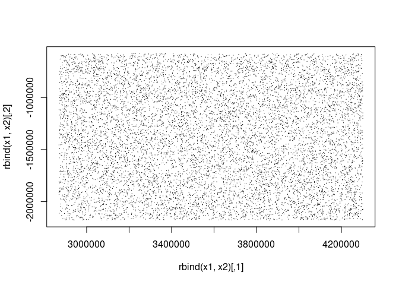

<!-- README.md is generated from README.Rmd. Please edit that file -->

# footprint

<!-- badges: start -->
<!-- badges: end -->

The goal of footprint bin point data at very high resolution, storing a
sparse grid. These tools use spatstat and raster packages.

## Installation

You can install the development version of footprint from
[GitHub](https://github.com/) with:

``` r
# install.packages("pak")
pak::pak("hypertidy/footprint")
```

``` r
library(footprint)  
library(terra)
#> terra 1.7.3
library(spatstat.geom)
#> Loading required package: spatstat.data
#> spatstat.geom 3.0-3
#> 
#> Attaching package: 'spatstat.geom'
#> The following objects are masked from 'package:terra':
#> 
#>     area, delaunay, rescale, rotate, shift, where.max, where.min
library(dplyr)
#> 
#> Attaching package: 'dplyr'
#> The following objects are masked from 'package:terra':
#> 
#>     intersect, union
#> The following objects are masked from 'package:stats':
#> 
#>     filter, lag
#> The following objects are masked from 'package:base':
#> 
#>     intersect, setdiff, setequal, union
llproj <- "+proj=longlat +ellps=WGS84 +datum=WGS84 +no_defs +towgs84=0,0,0"
proj <- "+proj=laea +lat_0=-90 +datum=WGS84 +units=m +no_defs +ellps=WGS84 +towgs84=0,0,0"

## very round-a-bout, but works
ex <- ext(project(rast(ext(100, 120, -60, -50), nrow = 100, ncol = 100, crs = llproj), proj))

## parent grid (sparse massive grid with 15m pixels)
g <- buildparent(ex, 15)

print(g)  ## don't ever populate the data of this object :)
#> class       : SpatRaster 
#> dimensions  : 107045, 95862, 1  (nrow, ncol, nlyr)
#> resolution  : 15, 15  (x, y)
#> extent      : 2866380, 4304310, -2180415, -574740  (xmin, xmax, ymin, ymax)
#> coord. ref. :

n <- 1e4
pts0 <- cbind(runif(n, xmin(g) + 3000 , xmax(g) - 3000), runif(n,ymin(g) + 3000, ymax(g) - 3000))
pts1 <- cbind(rnorm(n, pts0[,1], 500), rnorm(n, pts0[,2], 1500))

psegs <- function(x1, x2, add = FALSE) {
  if (!add) plot(rbind(x1, x2), type = "n")
  segments(x1[,1], x1[,2], x2[,1], x2[,2])
}
psegs(pts0, pts1)
```



``` r

diam <- rep(30, nrow(pts0))  ## diameter for density (can be per row )

Kcell <- vector("list", nrow(pts1))
kde <- FALSE

## this could be made a lot faster now 2023-08-07
for (i in seq(nrow(pts1))) {
  linp <- bpsp(pts0[i,], pts1[i,], g, diam[i]/2)
  if (kde) {
   pix <- density(linp, sigma = diam[i])
  } else {
   pix <- pixellate(linp)
  }
  rd <- rast(pix)
  rd[rd < quantile(values(rd)[,1], 0.75)] <- NA_real_
  
  vals <- values(rd)
  Kcell[[i]] <- tibble::tibble(cell = cellFromXY(g, xyFromCell(rd, seq_len(ncell(rd)))[!is.na(vals), ]), 
        prob = na.omit(vals))  
if (i %% 50 == 0) print(i)
}
#> [1] 50
#> [1] 100
#> [1] 150
#> [1] 200
#> [1] 250
#> [1] 300
#> [1] 350
#> [1] 400
#> [1] 450
#> [1] 500
#> [1] 550
#> [1] 600
#> [1] 650
#> [1] 700
#> [1] 750
#> [1] 800
#> [1] 850
#> [1] 900
#> [1] 950
#> [1] 1000
#> [1] 1050
#> [1] 1100
#> [1] 1150
#> [1] 1200
#> [1] 1250
#> [1] 1300
#> [1] 1350
#> [1] 1400
#> [1] 1450
#> [1] 1500
#> [1] 1550
#> [1] 1600
#> [1] 1650
#> [1] 1700
#> [1] 1750
#> [1] 1800
#> [1] 1850
#> [1] 1900
#> [1] 1950
#> [1] 2000
#> [1] 2050
#> [1] 2100
#> [1] 2150
#> [1] 2200
#> [1] 2250
#> [1] 2300
#> [1] 2350
#> [1] 2400
#> [1] 2450
#> [1] 2500
#> [1] 2550
#> [1] 2600
#> [1] 2650
#> [1] 2700
#> [1] 2750
#> [1] 2800
#> [1] 2850
#> [1] 2900
#> [1] 2950
#> [1] 3000
#> [1] 3050
#> [1] 3100
#> [1] 3150
#> [1] 3200
#> [1] 3250
#> [1] 3300
#> [1] 3350
#> [1] 3400
#> [1] 3450
#> [1] 3500
#> [1] 3550
#> [1] 3600
#> [1] 3650
#> [1] 3700
#> [1] 3750
#> [1] 3800
#> [1] 3850
#> [1] 3900
#> [1] 3950
#> [1] 4000
#> [1] 4050
#> [1] 4100
#> [1] 4150
#> [1] 4200
#> [1] 4250
#> [1] 4300
#> [1] 4350
#> [1] 4400
#> [1] 4450
#> [1] 4500
#> [1] 4550
#> [1] 4600
#> [1] 4650
#> [1] 4700
#> [1] 4750
#> [1] 4800
#> [1] 4850
#> [1] 4900
#> [1] 4950
#> [1] 5000
#> [1] 5050
#> [1] 5100
#> [1] 5150
#> [1] 5200
#> [1] 5250
#> [1] 5300
#> [1] 5350
#> [1] 5400
#> [1] 5450
#> [1] 5500
#> [1] 5550
#> [1] 5600
#> [1] 5650
#> [1] 5700
#> [1] 5750
#> [1] 5800
#> [1] 5850
#> [1] 5900
#> [1] 5950
#> [1] 6000
#> [1] 6050
#> [1] 6100
#> [1] 6150
#> [1] 6200
#> [1] 6250
#> [1] 6300
#> [1] 6350
#> [1] 6400
#> [1] 6450
#> [1] 6500
#> [1] 6550
#> [1] 6600
#> [1] 6650
#> [1] 6700
#> [1] 6750
#> [1] 6800
#> [1] 6850
#> [1] 6900
#> [1] 6950
#> [1] 7000
#> [1] 7050
#> [1] 7100
#> [1] 7150
#> [1] 7200
#> [1] 7250
#> [1] 7300
#> [1] 7350
#> [1] 7400
#> [1] 7450
#> [1] 7500
#> [1] 7550
#> [1] 7600
#> [1] 7650
#> [1] 7700
#> [1] 7750
#> [1] 7800
#> [1] 7850
#> [1] 7900
#> [1] 7950
#> [1] 8000
#> [1] 8050
#> [1] 8100
#> [1] 8150
#> [1] 8200
#> [1] 8250
#> [1] 8300
#> [1] 8350
#> [1] 8400
#> [1] 8450
#> [1] 8500
#> [1] 8550
#> [1] 8600
#> [1] 8650
#> [1] 8700
#> [1] 8750
#> [1] 8800
#> [1] 8850
#> [1] 8900
#> [1] 8950
#> [1] 9000
#> [1] 9050
#> [1] 9100
#> [1] 9150
#> [1] 9200
#> [1] 9250
#> [1] 9300
#> [1] 9350
#> [1] 9400
#> [1] 9450
#> [1] 9500
#> [1] 9550
#> [1] 9600
#> [1] 9650
#> [1] 9700
#> [1] 9750
#> [1] 9800
#> [1] 9850
#> [1] 9900
#> [1] 9950
#> [1] 10000

## summarize with dplyr
cell <- do.call(bind_rows, Kcell)
ss <- cell %>% group_by(cell) %>% summarize(prob = sum(prob))

rsum <- setValues(rast(ext(g), res = 50000, crs = crs(g)), 0)
ss$foreign <- cellFromXY(rsum, xyFromCell(g, ss$cell))
xsum <- ss %>% group_by(foreign) %>% summarize(prob = sum(prob)) %>% filter(!is.na(foreign))
rsum[xsum$foreign] <- xsum$prob

plot(rsum)
psegs(pts0, pts1, add = TRUE)
```


``` r

## zoom in
plot(crop(rsum, ext(3064556.06339375, 3203002.1878131, -925364.448947992, -816064.877037982)))
psegs(pts0, pts1, add = TRUE)
```


